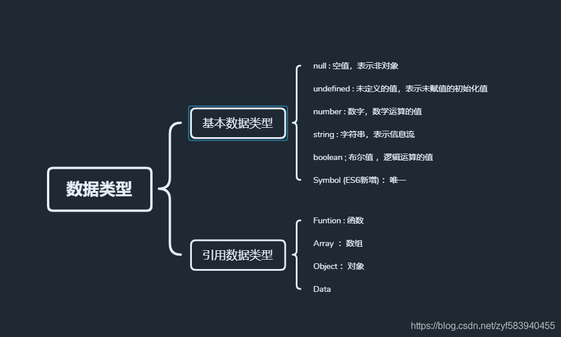

#### 1.react和vue的区别

采用的框架不同，react是MVC，vue是MVVM

react是单向数据流、vue是双向数据流

采用的模板语法不同，react是jsx，vue是vue

diff算法不同


#### 2.react和vue的diff算法的区别

vue和react的diff算法，都是忽略跨级比较，只做同级比较。vue diff时调动patch函数，参数是vnode和oldVnode，分别代表新旧节点。

vue比对节点，当节点元素类型相同，但是className不同，认为是不同类型元素，删除重建，而react会认为是同类型节点，只是修改节点属性

vue的列表比对，采用从两端到中间的比对方式，而react则采用从左到右依次比对的方式。当一个集合，只是把最后一个节点移动到了第一个，react会把前面的节点依次移动，而vue只会把最后一个节点移动到第一个。总体上，vue的对比方式更高效。


#### 3.vue的生命周期

###### beforeCreate( 创建前 )

在实例初始化之后，数据观测和事件配置之前被调用，此时组件的选项对象还未创建，el 和 data 并未初始化，因此无法访问methods， data， computed等上的方法和数据。

###### created ( 创建后 ）

实例已经创建完成之后被调用，在这一步，实例已完成以下配置：数据观测、属性和方法的运算，watch/event事件回调，完成了data 数据的初始化，el没有。 然而，挂在阶段还没有开始, $el属性目前不可见，这是一个常用的生命周期，因为你可以调用methods中的方法，改变data中的数据，并且修改可以通过vue的响应式绑定体现在页面上，，获取computed中的计算属性等等，通常我们可以在这里对实例进行预处理，也有一些童鞋喜欢在这里发ajax请求，值得注意的是，这个周期中是没有什么方法来对实例化过程进行拦截的，因此假如有某些数据必须获取才允许进入页面的话，并不适合在这个方法发请求，建议在组件路由钩子beforeRouteEnter中完成

###### beforeMount

挂在开始之前被调用，相关的render函数首次被调用（虚拟DOM），实例已完成以下的配置： 编译模板，把data里面的数据和模板生成html，完成了el和data 初始化，注意此时还没有挂在html到页面上。

###### mounted

挂在完成，也就是模板中的HTML渲染到HTML页面中，此时一般可以做一些ajax操作，mounted只会执行一次。

###### beforeUpdate

在数据更新之前被调用，发生在虚拟DOM重新渲染和打补丁之前，可以在该钩子中进一步地更改状态，不会触发附加地重渲染过程

###### updated（更新后）

在由于数据更改导致地虚拟DOM重新渲染和打补丁只会调用，调用时，组件DOM已经更新，所以可以执行依赖于DOM的操作，然后在大多是情况下，应该避免在此期间更改状态，因为这可能会导致更新无限循环，该钩子在服务器端渲染期间不被调用

###### beforeDestroy（销毁前）

在实例销毁之前调用，实例仍然完全可用，

1. 这一步还可以用this来获取实例，
2. 一般在这一步做一些重置的操作，比如清除掉组件中的定时器  和 监听的dom事件

###### destroyed（销毁后）

在实例销毁之后调用，调用后，所以的事件监听器会被移出，所有的子实例也会被销毁，该钩子在服务器端渲染期间不被调用


#### 4.vue的父组件和子组件生命周期钩子函数

###### 加载渲染过程：

父 beforeCreate -> 父 created -> 父 beforeMount -> 子 beforeCreate -> 子 created -> 子 beforeMount -> 子 mounted -> 父 mounted

###### 子组件更新过程：

父 beforeUpdate -> 子 beforeUpdate -> 子 updated -> 父 updated

###### 父组件更新过程：

父 beforeUpdate -> 父 updated

###### 销毁过程：

父 beforeDestroy -> 子 beforeDestroy -> 子 destroyed -> 父 destroyed


#### 5.vue指令

v-once指令、v-show指令、v-if指令、v-else指令、v-else-if指令、v-for指令、v-html指令、v-text指令、v-bind指令、v-on指令、v-model指令

#### 6.vue的自定义指令

**Vue自定义指令**和组件一样存在着全局注册和局部注册两种方式。 先来看看注册全局指令的方式，通过 Vue.directive ( id, [definition] ) 方式注册全局指令，第一个参数为自定义指令名称（ 指令名称不需要加 v- 前缀，默认是自动加上前缀的，使用指令的时候一定要加上前缀 ），第二个参数可以是对象数据，也可以是一个指令函数。

```javascript
    Vue.directive("focus", {
        inserted: function(el){
            el.focus();
        }
    })
```

全局注册好了，那么再来看看如何注册局部自定义指令，通过在Vue实例中添加 `directives` 对象数据注册局部自定义指令。

```javascript
        directives: {
            focus2: {
                inserted: function(el){
                    el.focus();
                }
            }
        }
```


#### 7.vue传值

###### 父传子

（1）在父组件的子组件标签上绑定一个属性，[挂载](https://so.csdn.net/so/search?q=挂载&spm=1001.2101.3001.7020)要传输的变量
（2）在子组件中通过props来接受数据，props可以是[数组](https://so.csdn.net/so/search?q=数组&spm=1001.2101.3001.7020)也可以是对象，接受的数据可以直接使用 props: [“属性 名”] props:{属性名:数据类型}

```javascript
    //父组件
    <son :data='name'></son> 
    //子组件
      props:["data"],
```


#### 8.vue中的history和hash的区别

hash模式url里面永远带着#号，开发当中默认使用这个模式。如果用户考虑url的规范那么就需要使用history模式，因为history模式没有#号，是个正常的url，适合推广宣传；
功能上：比如我们在开发app的时候有分享页面，那么这个分享出去的页面就是用vue或是react做的，咱们把这个页面分享到第三方的app里，有的app里面url是不允许带有#号的，所以要将#号去除那么就要使用history模式，但是使用history模式还有一个问题就是，在访问二级页面的时候，做刷新操作，会出现404错误，那么就需要和后端人配合，让他配置一下apache或是nginx的url重定向，重定向到你的首页路由上就ok了


#### 9.vue中的路由守卫

###### vue-router全局有三个守卫：

router.beforeEach 全局前置守卫 进入路由之前
router.beforeResolve 全局解析守卫(2.5.0+) 在beforeRouteEnter调用之后调用
router.afterEach 全局后置钩子 进入路由之后

###### vue-router组件内的守卫：

beforeRouteEnter 进入路由之前
beforeRouteUpdata(2.2新增) 路由更新时
beforeRouteLeave 离开路由之前

###### vue-router单个路由独享的守卫：

beforeEnter

###### 路由守卫钩子函数里面有三个参数。

to,from,next 这三个参数：
to和from是将要进入和将要离开的路由对象,路由对象指的是平时通过this.$route获取到的路由对象。
next:Function 这个参数是个函数，且必须调用，否则不能进入路由(页面空白)。
next() 进入该路由。
next(false): 取消进入路由，url地址重置为from路由地址(也就是将要离开的路由地0址)。 next 跳转新路由，当前的导航被中断，重新开始一个新的导航。

#### 10.route和router的区别

1. router是VueRouter的一个对象，通过Vue.use(VueRouter)和VueRouter构造函数得到一个router的实例对象，这个对象中是一个全局的对象，包含了所有的路由包含了许多关键的对象和属性。例如history对象

$router.push({path:’/path’}); 本质是向history栈中添加一个路由，在我们看来是 切换路由，但本质是在添加一个history记录

$router.replace({path:’/path’}); 替换路由，没有历史记录

2. route是一个跳转的路由对象，每一个路由都会有一个route对象，是一个局部的对象，可以获取对应的name,path,params,query等


#### 11.项目中遇到的问题

**（1）axios请求中post请求的坑**。刚开始的坑是，使用axios的post方法请求数据，数据被拦截，数据一直传不到后端那边。后来查文档才得知 axios对于post请求是有拦截功能的，需要自己判断，或者使用提请的 qs 方法，将传给后端的数据进行下处理。

**（2）路由传参的功能的坑**。之前一直使用路由传参，但是当本页面刷新的时候，页面上是没有参数的，因为参数是从上个页面传入进来的。   解决办法：使用了缓存，和vuex状态管理。但是由于项目并不是很大型的项目，所以使用最多的是缓存。

**（3）页面缓存的坑**。有个填写信息的页面，需要填写一部分信息，进入查新协议页面，返回的时候，页面上填写的信息还需要留存。  解决办法：使用vue提供的keep-alive，来完成页面的缓存的。

**（4）vue组件动态加载的坑**。由于首页的排版不确定，然后想着，让组件动态显示，根据后端传入的数据，传入那个组件的数据，就显示那个组件。解决办法：和后端商量好，做个标识。前端根据标识判断，动态显示组件。 使用到了vue中的  , 刚开始想着是不是和原生js一样使用append直接可以插入进入呢，但是后来发现根本不可以，思路是可以的，但是实现起来是行不通的。因为append后面插入的必须是个节点，而不是组件。后来就去查阅vue文档。

**（5）解析后端返回的map格式数据的坑**。 之前解析数据的时候，直接就可以拿去，然后直接渲染页面使用即可。但是这次遇到后端返回的是map格式的数据，这就得解析下了。  例如：body['1']  。根据返回的格式，自己解析成自己需要的数据格式。

**（6）更新文件缓存的坑**。每次打包好文件给后端更新的时候，用户手机上总会留下，上次版本的信息，而且每次都得清下缓存，才会显示最新版本的数据。后来，我师傅提了个建议，让后端返回一个更新版本的接口，前端每次更新版本的时候，都会给后端传入时间戳，然后后端接收后判断和库里的时间戳是否相同，相同的返回不需要更新，不相同的话，返回要更新，然后前端这边的处理方法是：需要更新的话，清除掉缓存，刷新页面即可。

虽然说给.js  .css文件后缀加上时间戳也是可以的，但是页面的入口index.html每次都是一样的，所以。。。就不会更新，，百度一些说在nginx服务器上，写上强制更新，但是由于公司服务器上的文件很多，万一操作失误那就麻烦了

**（7）获取首页链接里面的参数问题**。获取是可以获取到，只要不跳转出这个项目的页面，都是可以的，但是该项目链接了许多外链，所以，有时候返回的时候，页面就会显示空白，因为获取的参数出了问题。解决办法：将参数设置成了缓存，但是返回的速度快了，首页同样还是会出现拿不到参数，的问题。


#### 12、登录注册你会考虑哪些问题

跨平台操作系统的多端同时登录问题，是否允许同一平台多个设备登录一个账号的问题。账号已登录，挤出登录，在新设备登录的问题

#### 13、vue2和vue3的区别

##### vue3：

- Vue3使用composition API，让组件拥有了更加良好的代码组织结构；
- Vue3采用函数式编程方式，`打破了this的限制`，能够更好的复用性，真正体现实现功能的高内聚低耦合，更利于代码的可扩展性和可维护性。
- Vue3更友好的支持兼容TS
- 基于**Proxy**和**Reflect**，可以原生监听数组，可以监听对象属性的添加和删除或多层嵌套数据结构的响应。
- Proxy代理的是整个对象，而不是对象的某个特定属性，不需要我们通过遍历来逐个进行数据绑定。
- 不需要一次性遍历data的属性，可以显著提高性能。
- Tree-shaking：支持摇树优化（摇树优化后会将不需要的模块修剪掉，真正需要的模块打到包内。优化后的项目体积只有原来的一半，加载速度更快。）

##### vue2：

- Vue2中使用的选项API（options API），使我们的代码中大量的使用到了this

- **Object.defineProperty**只能劫持对象的属性,因此我们需要对每个对象的每个属性进行遍历。
- 在遇到一个对象的属性还是一个对象的情况下，需要递归监听，对性能影响比较大。
- 由于Vue会在初始化实例时对属性执行getter/setter转化，所有属性必须在data对象上存在才能让Vue将它转换为响应式。
- 对于已经创建的实例，Vue 不允许动态添加根级别的响应式属性。但是，可以使用 `Vue.set(object, propertyName, value)` 或`vm.$set`方法向嵌套对象添加响应式属性。


#### 14、vue的双向绑定（响应式）

简单来说就是使用`Object.defineProperty`这个`API`为数据设置`get`和`set`。当读取到某个属性时，触发`get`将读取它的组件对应的`render watcher`收集起来；当重置赋值时，触发`set`通知组件重新渲染页面。如果数据的类型是数组的话，还做了单独的处理，对可以改变数组自身的方法进行重写，因为这些方法不是通过重新赋值改变的数组，不会触发`set`，所以要单独处理。响应系统也有自身的不足，所以官方给出了`$set`和`$delete`来弥补。

数组响应式总结：数组的依赖收集还是在`get`方法里，不过依赖的存放位置会有不同，不是在`defineReactive`方法的`dep`里，而是在`Observer`类中的`dep`里，依赖的更新是在拦截器里的数组异变方法最后手动更新的。

#### 16、接口在哪个生命周期里写，区别是什么

接口请求一般放在mounted中，但需要注意的是服务端渲染时不支持mounted，需要放到created中。需要操作DOM时，要写在mounted，组件挂载完后，要不就要用nextTick。


#### 17、防抖节流

###### 定义

- 节流: n 秒内只运行一次，若在 n 秒内重复触发，只有一次生效
- 防抖: n 秒后在执行该事件，若在 n 秒内被重复触发，则重新计时

###### 应用场景

防抖在连续的事件，只需触发一次回调的场景有：

- 搜索框搜索输入。只需用户最后一次输入完，再发送请求
- 手机号、邮箱验证输入检测
- 窗口大小`resize`。只需窗口调整完成后，计算窗口大小。防止重复渲染。

节流在间隔一段时间执行一次回调的场景有：

- 滚动加载，加载更多或滚到底部监听
- 搜索框，搜索联想功能

#### 18、for  of  能遍历对象吗，及其方式

for of+**Object.entries()**方法返回一个给定对象自身可[枚举](https://so.csdn.net/so/search?q=枚举&spm=1001.2101.3001.7020)属性的键值对数组

```javascript
let a={
    a:100,
    b:200
}
for(let [key,value] of Object.entries(a))
    console.log(key,value)
```


#### 19、vue项目中，meta关键字的动态运用

###### 使用vue-meta-info动态生成meta标签

npm install vue-meta-info --save

```javascript
// 引入 vue-meta-info
import Vue from 'vue'
import MetaInfo from 'vue-meta-info'

// 注册 vue-meta-info 
Vue.use(MetaInfo)
```

###### 组件内静态使用：

```vue
<script>
export default {
  metaInfo: {
    title: '',  // 设置title
    meta: [{                 
      name: 'keywords',  // 设置关键字
      content: '这是关键字'
    },
    {
      name: 'description',  // 设置页面描述
      content: '这是页面描述'
    }],
    link: [{   // 设置link             
      rel: 'asstes',  
      href: 'https://me.csdn.net/weixin_45426836'
    }]
  }
}
</script>
```


#### 20、工作中用的哪个web服务器（）

###### nginx appache

Nginx是一款[轻量级](https://link.zhihu.com/?target=https%3A//baike.baidu.com/item/%E8%BD%BB%E9%87%8F%E7%BA%A7/10002835)的[Web](https://link.zhihu.com/?target=https%3A//baike.baidu.com/item/Web/150564) 服务器/[反向代理](https://link.zhihu.com/?target=https%3A//baike.baidu.com/item/%E5%8F%8D%E5%90%91%E4%BB%A3%E7%90%86/7793488)服务器及[电子邮件](https://link.zhihu.com/?target=https%3A//baike.baidu.com/item/%E7%94%B5%E5%AD%90%E9%82%AE%E4%BB%B6/111106)（IMAP/POP3）代理服务器，在BSD-like 协议下发行。其特点是占有内存少，[并发](https://link.zhihu.com/?target=https%3A//baike.baidu.com/item/%E5%B9%B6%E5%8F%91/11024806)能力强，事实上nginx的并发能力确实在同类型的网页服务器中表现较好

#### 21、proxy的用法

**Proxy** 对象用于创建一个对象的代理，从而实现基本操作的拦截和自定义（如属性查找、赋值、枚举、函数调用等）。


#### 22、处理父子组件异步情况

###### 1.在父组件使用子组件的时候添加v-if判断

在渲染子组件的时候加上一个条件,data1是父组件调用接口返回的数据。当有数据的时候在去渲染子组件。这样就会形成天然的阻塞。在父组件的created中的请求返回数据后，才会执行子组件的created，mounted。最后执行父组件的mounted。

```vue
<div class="test">
    <children v-if="data1" :data="data1" ></children>
</div>
```

###### 2.在自组件watch prop变量

在父组件请求数据完成并赋值对应的传给子组件的变量后，子组件prop发生改变，子组件watch对应的prop，再做相关操作

```vue
watch:{
   "props中的变量":{
      deep:true,
      handler:function(newVal,oldVal) {
        this.$nextTick(() => {
          this.xxx（子组件data定义变量） = newVal
        })
      }
    },
}
```


#### 23、vuex的用法

#### 24、mixin

###### 民间解释：

将组件的公共逻辑或者配置提取出来，哪个组件需要用到时，直接将提取的这部分混入到组件内部即可。这样既可以减少代码冗余度，也可以让后期维护起来更加容易。

这里需要注意的是：提取的是逻辑或配置，而不是HTML代码和CSS代码。其实大家也可以换一种想法，mixin就是组件中的组件，Vue组件化让我们的代码复用性更高，那么组件与组件之间还有重复部分，我们使用Mixin在抽离一遍。

###### Mixin和Vuex的区别？

上面一点说Mixin就是一个抽离公共部分的作用。在Vue中，Vuex状态管理似乎也是做的这一件事，它也是将组件之间可能共享的数据抽离出来。两者看似一样，实则还是有细微的区别，区别如下：

- Vuex公共状态管理，如果在一个组件中更改了Vuex中的某个数据，那么其它所有引用了Vuex中该数据的组件也会跟着变化。
- Mixin中的数据和方法都是独立的，组件之间使用后是互相不影响的。

#### 25、promise有哪些静态的方法

##### promise.prototype.finally

不管promise成功还是失败，都会执行finally，不受promise状态的影响。

```javascript
p.then(res=>{
    console.log(res)
}).finally(()=>{
    console.log('finally执行');
})
```


##### promise.prototype.all

它可以同时处理多个promise实例，等上面的promise函数都执行完后，他才会执行，有一个函数错误，别的也显示不出来，会报错。他会返回一个新的promise对象;

```javascript
var p1=ajax("get","test.json")
var p2=ajax("get","test.json")
var p3=ajax("get","test.json")
var p=Promise.all([p1,p2,p3])
p.then(([s1,s2,s3])=>{
    console.log(s1);
    console.log(s2);
    console.log(s3);
})
```

##### promise.prototype.race

它也可以同时处理多个promise实例，有一个promise执行完，他就只显示那一个，根据当前第一个实例对象，来决定resolve或reject

```javascript
var p1=ajax("get","test.json");
var p2=ajax("get","test.json");
var p3=ajax("get","test.json");
var p=Promise.race([p1,p2,p3]);
p.then(res=>{
    console.log(res)
})
```


#### 26、this的指向

普通函数一般情况下指向window，因为window是所有普通函数的调用者

在对象方法中的调用 this指向该对象

原型对象里面的方法以及构造函数调用时 this指向实例对象

事件绑定函数时 this指向绑定事件对象

定时器函数和立即执行函数的this都指向window


#### 27、call apply bind的区别

- 三者都可以改变函数的this对象指向。
- 三者第一个参数都是this要指向的对象，如果如果没有这个参数或参数为undefined或null，则默认指向全局window。
- 三者都可以传参，但是apply是数组，而call是参数列表，且apply和call是一次性传入参数，而bind可以分为多次传入。
- bind 是返回绑定this之后的函数，便于稍后调用；apply 、call 则是立即执行 。

#### 28、判断数据类型的方法

###### **typeof**

返回的是一个数据类型

```javascript
typeof` `''``; ``// string 有效
typeof` `1; ``// number 有效
typeof` `Symbol(); ``// symbol 有效
typeof` `true``; ``//boolean 有效
typeof` `undefined; ``//undefined 有效
typeof` `null``; ``//object 无效
typeof` `[] ; ``//object 无效
typeof` `new` `Function(); ``// function 有效
typeof` `new` `Date(); ``//object 无效
typeof` `new` `RegExp(); ``//object 无效
```

###### **instanceof**

instanceof 是用来判断 A 是否为 B 的实例，表达式为：A instanceof B，如果 A 是 B 的实例，则返回 true,否则返回 false。 在这里需要特别注意的是：**instanceof 检测的是原型**

```javascript
instanceof (A,B) = {
    var L = A.__proto__;
    var R = B.prototype;
    if(L === R) {
        // A的内部属性 __proto__ 指向 B 的原型对象
        return true;
    }
    return false;
}
```


###### toString

toString() 是 Object 的原型方法，调用该方法，默认返回当前对象的 [[Class]] 。这是一个内部属性，其格式为 [object Xxx] ，其中 Xxx 就是对象的类型。

对于 Object 对象，直接调用 toString() 就能返回 [object Object] 。而对于其他对象，则需要通过 call / apply 来调用才能返回正确的类型信息。

```javascript
Object.prototype.toString.call('') ;   // [object String]
Object.prototype.toString.call(1) ;    // [object Number]
Object.prototype.toString.call(true) ; // [object Boolean]
Object.prototype.toString.call(Symbol()); //[object Symbol]
Object.prototype.toString.call(undefined) ; // [object Undefined]
Object.prototype.toString.call(null) ; // [object Null]
Object.prototype.toString.call(new Function()) ; // [object Function]
Object.prototype.toString.call(new Date()) ; // [object Date]
Object.prototype.toString.call([]) ; // [object Array]
Object.prototype.toString.call(new RegExp()) ; // [object RegExp]
Object.prototype.toString.call(new Error()) ; // [object Error]
Object.prototype.toString.call(document) ; // [object HTMLDocument]
Object.prototype.toString.call(window) ; //[object global] window 是全局对象 global 的引用
```


#### 29、左端固定，右侧自适应布局，flex：1的属性

###### flex-grow：

定义项目的的放大比例

> 默认为 0，即 即使存在剩余空间，也不会放大；
>  所有项目的 `flex-grow` 为 1：等分剩余空间（自动放大占位）；
>  `flex-grow` 为 n 的项目，占据的空间（放大的比例）是 `flex-grow` 为 1 的 n 倍。

###### flex-shrink：

定义项目的缩小比例

> 默认为 1，即 如果空间不足，该项目将缩小； 所有项目的 `flex-shrink` 为 1：当空间不足时，缩小的比例相同； `flex-shrink` 为 0：空间不足时，该项目不会缩小； `flex-shrink` 为 n 的项目，空间不足时缩小的比例是 flex-shrink 为 1 的 n 倍。

###### flex-basis:

定义在分配多余空间之前，项目占据的主轴空间（main size），浏览器根据此属性计算主轴是否有多余空间

> 默认值为 `auto`，即 项目原本大小；
>  设置后项目将占据固定空间。


#### 30、bindtap和catchtap的区别

bindtap绑定方式自带冒泡特性

catchtap不带冒泡特性

#### 31、vue环境搭建

安装node

安装cnpm

安装vue-cli脚手架  or  npm init vue@latest

创建一个项目  create-vue

选择要添加的插件

cnpm i 安装依赖

#### 32、 菜单权限

#### 33、小程序支付功能操作

#### 34、基本数据类型和复合数据类型的区别

基本数据类型和引用类型的根本区别在于其数据在内存中的存储位置不同，基本数据类型存储在栈内存中，而引用类型存储在堆内存中，栈内存由系统自动分配自动释放，按顺序存储，而堆内存中的数据则是动态向系统申请空间，存储的顺序并不是连续的，



#### 35、最简单的深拷贝方式

**JSON**.**parse**(**JSON**.**stringify**(obj)

会忽略 `undefined`和`symbol`；

不可以对`Function`进行拷贝，因为`JSON`格式字符串不支持`Function`，在序列化的时候会自动删除；

诸如 `Map`, `Set`, `RegExp`, `Date`, `ArrayBuffer `和其他内置类型在进行序列化时会丢失；

不支持循环引用对象的拷贝;（循环引用的可以大概地理解为一个对象里面的某一个属性的值是它自己）

#### 36、简单讲讲闭包

#### 37、const  var  let的区别

var 存在变量提升，能重复声明

let声明变量，const声明的是常量，常量声明之后不能进行修改，变量可以进行修改；

let和const不存在变量提升，

const声明的时候要设初始值

const对于数组和对象里元素的修改，不算修改常量，常量所指向的地址没有改变；

#### 38、create干了什么

#### 39、强缓存和协商缓存

###### 强缓存：

浏览器不会像服务器发送任何请求，直接从本地缓存中读取文件并返回Status Code: 200 OK

###### 协商缓存:

 向服务器发送请求，服务器会根据这个请求的request header的一些参数来判断是否命中协商缓存，如果命中，则返回304状态码并带上新的response header通知浏览器从缓存中读取资源；

强缓存在本地缓存中找不到文件话，会去协商缓存，向服务器发送请求，获取资源存到本地缓存

###### **浏览器缓存过程：**

1. 浏览器**第一次**加载资源，服务器返回200，浏览器将资源文件从服务器上请求下载下来，并把**response header**及该请求的**返回时间**(要与Cache-Control和Expires对比)一并缓存；
2. 下一次加载资源时，先比较当前时间和上一次返回200时的**时间差**，如果没有超过Cache-Control设置的max-age，则没有过期，命中强缓存，不发请求直接从本地缓存读取该文件（如果浏览器不支持HTTP1.1，则用Expires判断是否过期）；
3. **如果时间过期**，服务器则查看header里的**If-None-Match**和**If-Modified-Since** ；
4. 服务器**优先根据Etag**的值判断被请求的文件有没有做修改，Etag值一致则没有修改，命中协商缓存，返回304；如果不一致则有改动，直接返回新的资源文件带上新的Etag值并返回 200；
5. 如果服务器收到的请求没有Etag值，则将**If-Modified-Since**和被请求文件的最后修改时间做比对，一致则命中协商缓存，返回304；不一致则返回新的**last-modified和文件**并返回 200；

使用协商缓存主要是为了进一步降低数据传输量，如果数据没有变，就不必要再传一遍

#### 40、get和post的区别

1. GET提交的数据放在URL中，POST则不会。这是最显而易见的差别。这点意味着GET更不安全（POST也不安全，因为HTTP是明文传输抓包就能获取数据内容，要想安全还得加密）
2. GET回退浏览器无害，POST会再次提交请求（GET方法回退后浏览器再缓存中拿结果，POST每次都会创建新资源）
3. GET提交的数据大小有限制（是因为浏览器对URL的长度有限制，GET本身没有限制），POST没有
4. GET可以被保存为书签，POST不可以。这一点也能感受到。
5. GET能被缓存，POST不能
6. GET只允许ASCII字符，POST没有限制
7. GET会保存再浏览器历史记录中，POST不会。这点也能感受到。


#### 41、事件冒泡，事件捕获，事件代理

事件冒泡会从当前触发的事件目标一级一级往上传递，依次触发，直到document为止。不处于嵌套关系的时候（从里到外）
事件捕获会从document开始触发，一级一级往下传递，依次触发，直到真正点击的事件目标为止。(从外到里)

```html
<!DOCTYPE html>
<html>
    <head>
        <meta charset="UTF-8">
        <title></title>
    </head>
    <style type="text/css">
        #box1 { width: 300px; height: 300px; background: blueviolet; }
        #box2 { width: 200px; height: 200px; background: aquamarine; }
        #box3 { width: 100px; height: 100px; background: tomato; }
        div { overflow: hidden; margin: 50px auto; }
    </style>
    <body>
        <div id="box1">
            <div id="box2">
                <div id="box3"></div>
            </div>
        </div>
        <script>
            function sayBox3() {
                console.log('你点了最里面的box');
            }
            function sayBox2() {
                console.log('你点了最中间的box');
            }
            function sayBox1() {
                console.log('你点了最外面的box');
            }
            // 事件监听，第三个参数是布尔值，默认false，false是事件冒泡，true是事件捕获
            document.getElementById('box3').addEventListener('click', sayBox3, false);
            document.getElementById('box2').addEventListener('click', sayBox2, false);
            document.getElementById('box1').addEventListener('click', sayBox1, false);

        </script>
    </body>
</html>
```

###### 事件委托

- 指将事件统一绑定给元素的共同的祖先元素
- 当后代上的事件触发时,会一直冒泡到祖先元素
- 通过祖先元素的响应函数来处理事件

###### 阻止冒泡event.stopPropagation()：

```javascript
function sayBox3(event) {
    // 阻止冒泡
    event.stopPropagation();
    //ie阻止冒泡
    event.cancelBubble = true;
    console.log('你点了最里面的box');
}
document.getElementById('box3').addEventListener('click', sayBox3, false);
```


#### 42、HTML的渲染过程

1．解析HTML文件，创建DOM树

2．解析CSS,形成CSS对象模型

3．将CSS与DOM合并，构建渲染树（renderingtree）

4．布局和绘制


#### 43、块级元素和行内元素的区别

######  行内元素

会在一条直线上排列（默认宽度只与内容有关），都是同一行的，水平方向排列。行内元素不能嵌套包含块级元素，可以嵌套包含一些文本内容和一些行内元素，行内元素不可设置宽高。

```html
<a> 链接
<abbr>  表示一个缩写形式
<b> 字体加粗
<br>    换行
<i> 斜体文本效果
   向网页中嵌入一幅图像
<input> 输入框
<label> 标签为 input 元素定义标注（标记）
<q> 定义短的引用
<select>创建单选或多选菜单
<small> 呈现小号字体效果
<span>  组合文档中的行内元素
<strong>语气更强的强调的内容
<sub>   定义下标文本
<sup>   定义上标文本
```


######   块级元素

各占据一行（默认宽度是它本身父容器的100%（和父元素的宽度一致），与内容无关），垂直方向排列。块级元素从新行开始，结束接着一个断行。块级元素可以嵌套包含块级元素和行内元素

```html
div ul ol li h1 h2 h3 h4… p
```


#### 44、闭包

###### 定义

内层的作用域访问它外层函数作用域里的参数/变量/函数时，闭包就产生了。

###### 作用

读取函数内部的变量；让这些变量始终保持在内存之中。

###### 缺点

闭包的不足：由于闭包会引用它外层函数作用域里的变量函数，因此，会比其他非闭包形式的函数占用更多内存，当外层函数执行完毕退回函数调用栈（call stack）的时候，外层函数作用域里变量因为被引用着，可能并不会被引擎的垃圾回收器回收，因而会引起内存泄漏。过度使用闭包会导致内存占用过多，甚至内存泄漏。

```javascript
var timer = null;
window.onresize = function () {
  clearTimeout(timer);
  timer = setTimeout(function () {
    console.log(document.documentElement.clientWidth);
  }, 400);
};
/*使用闭包实现函数节流*/
function throttle(fn, delay) {
  var timer = null;
  return function () {
    clearTimeout(timer);
    timer = setTimeout(fn, delay);
  };
}
window.onresize = throttle(function () {
  console.log(document.documentElement.clientWidth);
}, 400);

```


#### 45、js原生基数据类型本身没有方法，它为什么还能用方法呢？

因为有个叫"`基本包装类型`"的东西。

`Object、Array`等引用类型，`JavaScript`还为我们提供了三种特殊的引用类型：`String`、`Number`和`Boolean`，方便我们操作对应的基本类型。

上面的`word`尽管使用了`substring`方法，`word`本身的值是不会变的，调用这个方法只是返回了一个新的字符串。这就是基本包装类型的作用了。**本来你是没有方法的，但是你想用方法的时候，你尽管调，对应的基本包装类型有这个方法就行**。例如上面的`substring`方法，`string`这个基本类型是不可能有这个方法的，但是`String`这个包装类型有，它会把这个方法执行完把结果返回。在执行到下面这行代码的时候，发生了很多事情：

```vbscript
 word.substring(0, 7)
```

首先，他会从内存中读取`word`的值，当处于这种读取模式下的时候，后台就开始干活了。`JS高级程序设计`是这样描述后台完成的这些动作的：

1. 创建`String`类型的一个实例
2. 在实例上调用指定的方法
3. 销毁这个实例

上面的代码可以解释为：

```ini
const _word = new String('you are the best')
const subWord = _word.substring(0, 7) // "you are"
_word = null // 方法调用后立即卸载
```

所以，这样我们就明白了，并不是基本类型`string`执行了自身方法，而是后台为它创建了一个对应的基本包装类型`String`，它根据基本类型的值实例化出了一个实例，让这个实例去调用指定方法，最后销毁自己。


#### 46、vue的动态路由next的ready


#### 47、vue2注入方式

使用`provide/inject`这一对API，可以**暴露出父组件的数据和方法供所有后代组件**使用。这个特性有两个部分：父组件有一个 `provide` 选项来提供数据，子组件有一个 `inject` 选项来开始使用这些数据。

现有父组件和子组件如下

`父组件`：

```vue
<template>
  <div class="parent">
    <div>父组件：{{ this.name }}</div>
    <button @click="changeIdol">改变偶像</button>
    <hr>
    <child></child>
  </div>
</template>

<script>
import Child from './Child'
export default {
  name: 'Parent',
  components: {
    Child
  },
  provide() {
    return {
      parentName: this.name
    }
  },
  data() {
    return {
      name: '小松菜奈'
    }
  },
  methods: {
    changeIdol() {
      this.name = '新垣结衣'
    }
  }
}
</script>
```

`子组件`：

```vue
<template>
  <div class="child">
    <!-- 模板中使用时，this不能省 -->
    <div>子组件：{{ this.parentName }}</div>
  </div>
</template>

<script>
  export default {
    name: 'Child',
    inject: ['parentName'],
    data() {
      return {
        
      }
    }
  }
</script>
```

如果父组件直接注入数据，不做任何处理，当我改变父组件的数据时，子组件的数据不变，可见响应式消失了。


#### 48、scoped

1、vue开发的h5，单页面应用程序，每一个vue文件如果直接使用class，多个文件的样式冲突

2、微信小程序是真正的多页面应用程序有物理隔离，页面中使用class，不会互相影响

3、uniapp做了一个设置，写vue代码，不需要主动加上scoped，打包成h5端的时候会自动添加上去，打包成微信小程序端不需要添加scoped


#### 49、jpg和png的区别

###### jpg

1.jpg属于有损压缩过的图片文件，是网络中比较流行使用的图片文件格式，jpg格式的图片可以将图像文件压缩到最小格式。

jpg格式的图片能在高度压缩率的同时，可以展现非常生动丰富的图像，不过随着压缩力度的增强，其图片品质会逐渐跌落。

jpg格式的图片则不可正常编辑。

###### png

2.png属于无损压缩的图片文件，PNG-8支持透明度，但是不支持半透明，所以PS存储的时候会有杂边颜色。PNG-24支持透明度，支持半透明，存储的文件大小会比PNG-8大。

但是png图片却不一样，体积小，空间占用少，与jpg格式相比下来，png图片在不损失图片数据的情况下，可以更快速的获取自己所需的图片，并且图片的质量不会因此而下降。

png格式的图片可以编辑，比如图片中的文字样式，线条等，可以用ps等软件更改。


#### 50、TS 中 interface 和 type 究竟有什么区别？

###### type 类型别名

type (类型别名)只是给类型起一个新名字，它并不是一个类型，只是一个别名而已。

type能声明基本数据类型、联合数据类型、交叉数据类型、元组。type也能声明对象。

type重复声明会报错。

###### interface 接口

interface（接口） 是 TS 设计出来用于定义对象类型的，可以对对象的形状进行描述。

interface能合并重复声明，当interface名称相同时属性不同，会自动合并。

interface主要用来，定义描述对象

#### 51、TS中的泛型

泛型就是创建类型变量用以接受任意类型。

```typescript
function identity<T>(arg: T): T {
    return arg;
}
```

我们给identity添加了类型变量`T`。 `T`帮助我们捕获用户传入的类型（比如：`number`），之后我们就可以使用这个类型。

接下来我们就可以通过这样的语法调用 `identity` 函数。

```js
identity<string>('hello');
```


#### 52、webpack的优化

###### 借助MiniCssExtractPlugin完成抽离css

```js
npm install mini-css-extract-plugin -D

const MiniCssExtractPlugin = require("mini-css-extract-plugin");
 {
 test: /\.less$/,
 use: [
 // "style-loader", // 不再需要style-loader，⽤MiniCssExtractPlugin.loader代替
  MiniCssExtractPlugin.loader,
  "css-loader", // 编译css
  "postcss-loader",
  "less-loader" // 编译less
 ]
 },
plugins: [
  new MiniCssExtractPlugin({
   filename: "css/[name]_[contenthash:6].css",
   chunkFilename: "[id].css"
  })
 ]
```


###### 压缩css

- 借助optimize-css-assets-webpack-plugin
- 借助cssnano

```js
npm install cssnano -D
npm i optimize-css-assets-webpack-plugin -D

const OptimizeCSSAssetsPlugin = require("optimize-css-assets-webpack-plugin");

new OptimizeCSSAssetsPlugin({
 cssProcessor: require("cssnano"), //引⼊cssnano配置压缩选项
 cssProcessorOptions: {
 discardComments: { removeAll: true }
 }
})
```


###### 压缩HTML

借助html-webpack-plugin

```js
new htmlWebpackPlugin({
   title: "京东商城",
   template: "./index.html",
   filename: "index.html",
   minify: {
     // 压缩HTML⽂件
     removeComments: true, // 移除HTML中的注释
     collapseWhitespace: true, // 删除空⽩符与换⾏符
     minifyCSS: true // 压缩内联css
  }
 }),
```


#### 53、vue项目中的优化

(https://blog.csdn.net/Sillydreamboy/article/details/118817261)


#### 54、set和map数据结构的区别

###### 集合Set

Set  没有键名，只有键值，不允许有重复值（敲黑板，画重点），重复的值是绝对相等（===），但是NaN和NaN是相等的值，两个对象总是不相等的。

- size属性
- add(value)  返回set本身，所以可以进行链式操作
- delete(value)  返回布尔值，表示是否删除成功
- has(value)  返回布尔值，表示是都有此value值
- clear(value)  无返回值
- 遍历 `keys()`   `values()`   `entires()`  `forEach()`


###### Map映射

键值对，key值相等，后者会覆盖前者，key值相等的概念是绝对相等（===），key值实际上是和内存地址绑定的，只要内存地址不一样，就默认是map的两个成员。

- `map.size`属性
- `map.set(key, value)`  其中key是否相同是严格的相等，除了+0 和 -0两个相等，返回map本身，所以可以进行链式操作
- `map.get(key)`
- `map.delete(key)`   返回布尔值，表示是都删除成功
- `map.clear()`  无返回值
- map遍历方法
   `map.keys()`，`map.values()`，`map.entires()`


#### 本地存储

| 特性         | cookie                                     | localStorage             | sessionStorage |      |
| ------------ | ------------------------------------------ | ------------------------ | -------------- | ---- |
| 数据生命周期 | 一般由服务器生成，可以设置过期时间         | 除非被清理，否则一直存在 | 页面关闭就清理 |      |
| 数据存储大小 | 4K                                         | 5M                       | 5M             |      |
| 与服务端通信 | 每次都会携带在 header 中，对于请求性能影响 | 不参与                   | 不参与         |      |

###### cookie

| 属性      | 作用                                                         |
| --------- | ------------------------------------------------------------ |
| value     | 如果用于保存用户登录态，应该将该值加密，不能使用明文的用户标识 |
| http-only | 不能通过 JS 访问 Cookie，减少 XSS 攻击                       |
| secure    | 只能在协议为 HTTPS 的请求中携带                              |
| same-site | 规定浏览器不能在跨域请求中携带 Cookie，减少 CSRF 攻击        |

​	

#### 55、keep-alive

###### **keep-alive用法简介**：我们在切换路由的时候，上一个页面就会被销毁，新的页面也会被创建，**keep-alive它可以缓存组件，防止组件销毁**，也就是说，我们在进行路由切换时，上次访问的页面数据依然存在，不会进行销毁。	

###### **include属性**：[字符串](https://so.csdn.net/so/search?q=字符串&spm=1001.2101.3001.7020)或正则表达式。只有名称匹配的组件会被缓存。

**exclude属性**： 字符串或[正则表达式](https://so.csdn.net/so/search?q=正则表达式&spm=1001.2101.3001.7020)。任何名称匹配的组件都不会被缓存。

​    属性值（*注意点*）在新创建的组件的这个位置 写name名称，在路由实例中配置路由的时候命名是不对的，应该是组件的名称


**activated、deactivated两个钩子函数**

有keep-live才会触发这两个[钩子函数](https://so.csdn.net/so/search?q=钩子函数&spm=1001.2101.3001.7020)，也是写在组件内部的，当进入组件时**activated**触发，离开时**deactivated** 触发，注意keep-alive包裹的组件切换时进行的就不再是组件销毁了。


#### 56、ref与reactive的区别？

ref与reactive 是 `Vue3` 新推出的主要 `API` 之一，它们主要用于响应式数据的创建。

- `template` 模板中使用的数据和方法，都需要通过 `setup` 函数 `return` 出去才可以被使用。

- `ref` 函数创建的响应式数据，在模板中可以直接被使用，在 `JS` 中需要通过 `.value` 的形式才能使用。

- `ref` 函数可以接收**原始数据类型**与**引用数据类型**。

- `reactive` 函数只能接收**引用数据类型**。

- `ref` 底层还是使用 `reactive` 来做，`ref` 是在 `reactive` 上在进行了封装，增强了其能力，使它支持了对原始数据类型的处理。

- 在 `Vue3` 中 `reactive` 能做的，`ref` 也能做，`reactive` 不能做的，`ref` 也能做。

  

#### 57、script setup 是干啥的？

`scrtpt setup` 是 `vue3` 的语法糖，简化了`组合式 API` 的写法，并且运行性能更好。使用 `script setup` 语法糖的特点：

- 属性和方法无需返回，可以直接使用。
- 引入`组件`的时候，会`自动注册`，无需通过 `components` 手动注册。
- 使用 `defineProps` 接收父组件传递的值。
- `useAttrs` 获取属性，`useSlots` 获取插槽，`defineEmits` 获取自定义事件。
- 默认`不会对外暴露`任何属性，如果有需要可使用 `defineExpose` 。


#### 58、v-if 和 v-for 的优先级哪个高？

在 `vue2` 中 `v-for` 的优先级更高，但是在 `vue3` 中优先级改变了。`v-if` 的优先级更高。

#### 59、谈谈pinia?

[Pinia](https://link.juejin.cn/?target=https%3A%2F%2Fgithub.com%2Fvuejs%2Fpinia) 是 `Vue` 官方团队成员专门开发的一个全新状态管理库，并且 `Vue` 的官方状态管理库已经更改为了 `Pinia`。在 [Vuex](https://link.juejin.cn/?target=https%3A%2F%2Fgithub.com%2Fvuejs%2Fvuex) 官方仓库中也介绍说可以把 `Pinia` 当成是不同名称的 `Vuex 5`，这也意味不会再出 `5` 版本了。

优点

- 更加轻量级，压缩后提交只有`1.6kb`。
- 完整的 `TS` 的支持，`Pinia` 源码完全由 `TS` 编码完成。
- 移除 `mutations`，只剩下 `state` 、 `actions` 、 `getters` 。
- 没有了像 `Vuex` 那样的模块镶嵌结构，它只有 `store` 概念，并支持多个 `store`，且都是互相独立隔离的。当然，你也可以手动从一个模块中导入另一个模块，来实现模块的镶嵌结构。
- 无需手动添加每个 `store`，它的模块默认情况下创建就自动注册。
- 支持服务端渲染（`SSR`）。
- 支持 `Vue DevTools`。
- 更友好的代码分割机制，[传送门](https://juejin.cn/post/7057439040911441957#heading-2)。

> `Pinia` 配套有个插件 [pinia-plugin-persist](https://link.juejin.cn/?target=https%3A%2F%2Fseb-l.github.io%2Fpinia-plugin-persist%2F)进行数据持久化，否则一刷新就会造成数据丢失